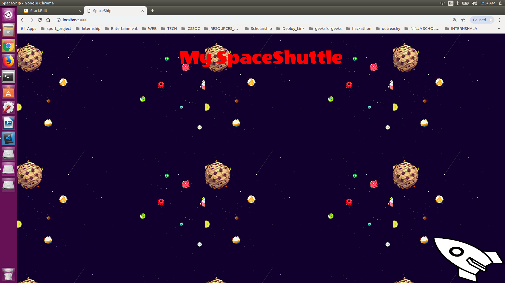

# SPACESHIP_GAME

  

To run and view the project :
Makes sure you have  have node.js and npm installed in your system. Refer here for setup on [ubuntu](https://tecadmin.net/install-latest-nodejs-npm-on-ubuntu/) and See [here](https://nodejs.org/en/) for more information.

Open the project in terminal and run the project with :

    node app

A spaceship game is developed using basic front end technologies i.e, HTML, CSS, Javascript along with a popular library of javascript which is Jquery. In this, a spaceship starts moving on pressing the arrow keys which are as follows:

-   **Up - Moves Up**
    
-   **Down - Moves Down**
    
-   **Right - Moves Right**
    
-   **Left - Moves Left**
    

The game implements the use of key codes which represent physical keys on the keyboard and they are not influenced by the modifier keys.  For example, the A key on the keyboard produces the same key code when pressed, even though its character code might be 65 (uppercase A)or 97 (lowercase a), depending on whether the Shift key is down at the same time.

It uses ready() event which occurs when the DOM has been loaded.  Because this event occurs after the document is ready, it is a good place to have all other jQuery events and functions

**Syntax**

    $(document).ready(function)

It uses two objects named key and direction for all the key codes and all possible direction respectively. The on() method has been used which attaches one or more event handlers for the selected elements and child elements.

**Syntax**

    `$(selector).on(event,function`)

**jQuery event used in the code :-**

**keydown** - The keydown event occurs when a keyboard key is pressed down.

**Keyup** - The keyup event occurs when a keyboard key is released.

Our project invokes **setInterval()** method which calls a function at specified interval ( in milliseconds)

**Syntax**

    setInterval(function, milliseconds )

The setInterval() method will continue calling the function until clearInterval() is called, or the window is closed.

**Technology Used:**

HTML, CSS, Javascript , Jquery

Click [here](https://drive.google.com/open?id=1xjnenQ52M-Zv2MLhcTpmZbBfJJN5CMYD) for demo
